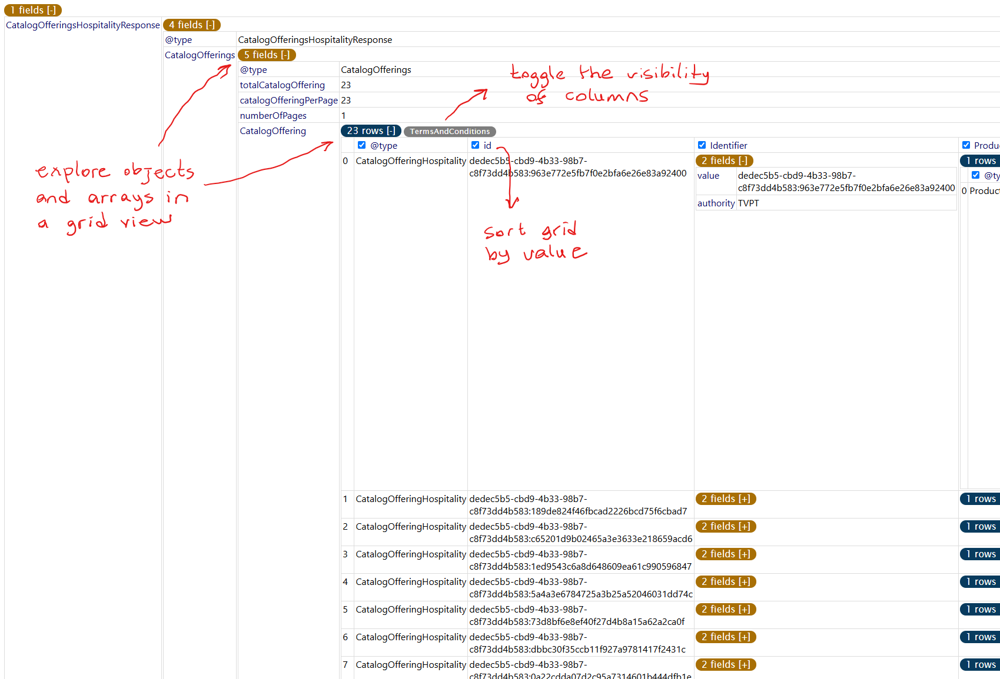

# JSON Explorer

Effortlessly explore, visualize, and interact with JSON data directly within Visual Studio Code.

## Features

- **Interactive JSON Viewer:** Render JSON data as a collapsible and expandable tree with intuitive navigation.
- **Table View for Arrays:** Display arrays as sortable and filterable tables with column visibility toggles.
- **Recursive Exploration:** Dive deep into nested objects and arrays with seamless recursion.
- **Column Management:** Easily hide or show specific columns in arrays and restore them when needed.
- **Dynamic Interaction:** Modify JSON display preferences on the fly for a tailored view.

---

> Tip: Right Click the JSON file and select "Open With..." and then "JSON Explorer"
